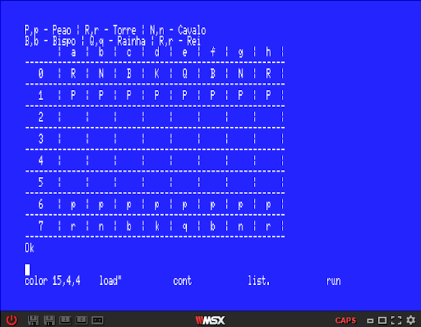

# VC_Tuyama
- Este repositório contém o pseudocódigo e o código em MSX BASIC para a exibição de um tabuleiro de xadrez na tela de uma máquina que rode a lingugem MSX BASIC. Tal procedimento pode ser simulado em: [WebMSX](https://webmsx.org/)
- Pode-se encontrar o Pseudocódigo e o código em MSX BASIC nos links a seguir:

  [Pseudocódigo](https://github.com/ProgramacaoEE2020/Basic_Tuyama/blob/master/C%C3%B3digos/pseudocodigo_chess.txt) 

  [MSX BASIC](https://github.com/ProgramacaoEE2020/Basic_Tuyama/blob/master/C%C3%B3digos/msx_chess.txt)
  
- O código funciona criando uma matriz de char 8 x 8 que representa o tabuleiro de xadrez. São então definidas em cada célula da matriz qual é a peça (R,N,B,Q,K,P ou vazio). Isso é feito por mediante um loop for dentro de outro loop for percorrendo toda a matriz. Para printar o tabuleiro de xadrez, novamente utilizou-se um loop for dentro de outro loop for, printando cada célula, além de detalhes visuais.

- A tela após o programa rodar fica como no screenshot abaixo:

